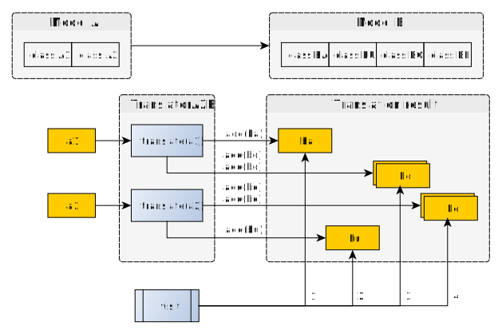

# Model Translation Utility

The objective of the utility is to simplify data translation from one object model to another. Examples of such translations are: BOM to API, ORM to BOM etc. There might be a need to support several versions of such translations like if one had several versions of API to support in parallel.

A model is given to the utility as a list of classes (type list). A single object of a class in the source model can be translated to a number of objects of different classes in the destination model.

The utility generates in compile time a special structure, which has inside an `std::tuple<std::list<T1>, std::list<T2>, ...>`, where each `std::list<Tx>` may hold a number of objects of the destination model. The model is defined as a `boost::mpl::list<T1, T2, ...>`. In your translation method you call the provided `add(tx)` function which appends to the appropriate list. After the translation is complete (= the structure is filled), you may visit all the generated objects in the order of types that you have specified in the model definition. The order matters in the case when, for example, you need to create parent objects before creating children which reference the parent. The reverse order would allow for deleting children before deleting the parent.



## Usage

The usage consists of these steps:

1. Define the destination model `ModelB` with the required order of classes:
   ```c++
   typedef boost::mpl::list<ObjectB1, ObjectB2> ModelB;
   ```
1. Derive your translator `Translate2B` from `a2b::Translator<Translate2B, ModelB>`, use `add` to fill the resulting structure:
   ```c++
   class Translate2B: public a2b::Translator<Translate2B, ModelB> {
   public:
     result_type translate(ObjectA1 const& obj) {
       return add( ObjectB1{ obj.x, obj.y } );
     }
   };
   ```
   The `add` function returns an intermediate result (a reference) which `translate` should return as well.

   The internal collection type, which by default is `std::list`, is configurable via the `a2b::Translator` third template parameter, like this:
   ```c++
   class Translate2B: public a2b::Translator<Translate2B, ModelB, std::vector>;
   ```
   The result of the translation in this case will be an `std::tuple` of different `std::vector` types.

1. Translate an object (or a collection of objects) by calling the `translate` method:
   ```c++
   std::vector<ObjectA1> const a1s = { ... };
   ObjectA2 const a2;
   
   Translate2B tr;
   auto const& result = tr.translate(a2); // Here you call directly your translate method
   tr.translate(a1s); // Here you continue filling the same result object
   ```

1. Visit the objects with a visitor or manually by inspecting the result of the translation:
   ```c++
   std::list<ObjectB1>& b1 = result.get<ObjectB1>();
   
   class MyVisitor {
   public:
     void operator()(ObjectB1 const& b1) {
       print(b1);
     }
     void operator()(ObjectB2 const& b2) {
       print(b2);
     }
   };
   
   result.visit(MyVisitor());
   ```
   Use `reverse_visit` to visit in the reverse order.

## Run tests
```sh
cmake CMakeLists.txt
make
./runTests

```
## Example
[Unit Test](test/uttranslator.cpp)
